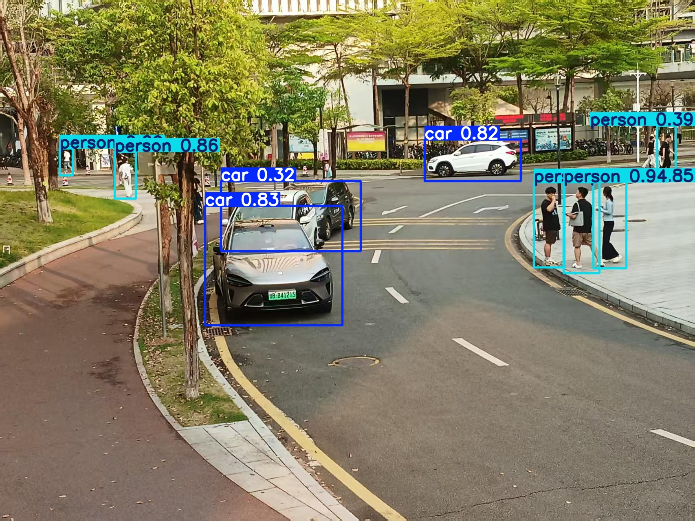

# 🚀 szu_yolov8n_experiment
深圳大学《人工智能》课程实验 | 基于 YOLOv8n 的道路场景行人与车辆检测

---

## 📌 项目简介
本实验基于 **YOLOv8n 轻量化目标检测模型**，实现道路场景下的**行人与车辆双类别检测**，完整复现从数据准备、模型训练到结果可视化的目标检测全流程，满足课程实验要求。

- 模型：YOLOv8n
- 任务：道路场景目标检测（行人/车辆）
- 数据集：230 张道路场景图片（LabelImg 手动标注）
- 训练轮数：50 epochs
- 最终 mAP@0.5：**0.87795**

---

## 🧪 实验目标
1.  理解 YOLO 系列目标检测算法的基本原理，掌握 YOLOv8n 轻量化模型的结构特点与优势
2.  熟练使用 Anaconda 搭建 Python 开发环境，掌握 Ultralytics 框架的基础配置与使用
3.  掌握数据集制作、LabelImg 标注工具的使用，熟悉 YOLO 格式数据集规范
4.  完成模型训练、参数调优与性能指标评估
5.  实现图片与视频推理，验证模型在实际场景中的检测效果

---

## 📁 项目结构
szu_yolov8n_experiment/
├── best.pt # 训练完成的最优模型权重
├── yolov8n.pt # 官方预训练模型权重
├── train_car_person.py # 模型训练脚本
├── predict.py # 图片检测推理脚本
├── predict_video.py # 视频检测推理脚本
├── image.jpg # 图片检测结果示例
├── video.mp4 # 视频检测结果示例
└── README.md # 项目说明文档


---

## 🧰 环境配置
```bash
conda create -n ai_env python=3.8
conda activate ai_env
pip install ultralytics opencv-python

---
##📊 模型训练与结果
训练阶段	box_loss	cls_loss	mAP@0.5
初始	1.61351	2.64486	0.29096
中期	1.40371	1.03363	0.82816
最终	1.15629	0.81950	0.87795

模型训练收敛稳定，定位与分类损失持续下降，最终 mAP@0.5 达到 0.87795，检测效果优秀。
---
##🖼️ 检测结果展示
图片检测效果
<p align="center">

<br>
<em>图：道路场景行人与车辆检测结果</em>
</p>
视频检测效果
<p align="center">
<a href="https://github.com/colebeler/szu_yolov8n_experiment/blob/master/video.mp4">
点击查看视频检测结果
</a>
</p>

---
##🚀 快速运行
1. 图片检测
python predict.py

2. 视频检测
python predict_video.py

---
##✅ 实验结论
成功完成了从数据集构建、标注到模型训练、推理的完整目标检测流程
YOLOv8n 轻量化模型在小数据集上表现优异，收敛稳定，无明显过拟合
模型对道路场景中的行人与车辆目标识别准确，可满足课程实验的所有要求
该模型适合嵌入式设备部署，具有良好的实际应用潜力


